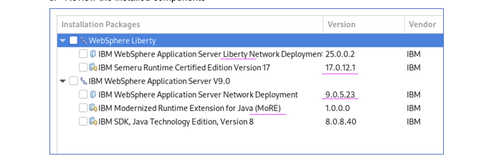
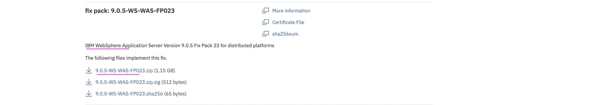

# Installing Modernized Runtime Extension (MoRE) 

MoRE provides the capability to continue using traditional WebSphere Application Server (tWAS) Operational Model to manage Java 17 and Java 8 applications within the same traditional WebSphere administrative environment


## 1. Introduction 

Existing WAS ND Clients can run both Java 8 and Java 17 applications using the same operating model. The same WAS Admin Console can be leveraged to manage the environment.


In the above diagram, the nodes `DMgr Node` and `tWAS Node` are  existing nodes. 

- `DMgr Node` is a Deployment Manager node which runs on Java 8.
- `tWAS Node` is a Server (tWAS) node which runs on Java 8.
- A new node called `MoRE Node` is a `Managed Liberty Server` which runs on Java 17.

To make the existing WAS ND setup into MoRE setup, you may need to do the following.
- Upgrade the WAS ND to WAS ND 9.0.5.23
- Install MoRE
- Install WAS ND Liberty for managed Liberty Server
- Create new node (MoRE node) with managed Liberty Server
- Deploy Java 17 application on top of the new node  (MoRE node).

It is required to have the below servers/software’s  installed and available. Lets install them in the upcoming steps.



## 2. Download Binaries

### 2.1. Create Install folder

Create a install folder like this.

```
mkdir -p /root/install1/
cd /root/install1/
```

### 2.2. Download WAS ND 9.0.5.23

Download the binary `IBM WebSphere Application Server Version 9.0.5 Fix Pack 23 for distributed platforms`
from the fix Central <a href="https://www.ibm.com/support/fixcentral/swg/downloadFixes?parent=ibm%2FWebSphere&product=ibm/WebSphere/WebSphere+Application+Server&release=All&platform=All&function=fixId&fixids=9.0.5-WS-WAS-FP023&includeRequisites=1&includeSupersedes=0&downloadMethod=http">URL</a>.




### 2.3 Download MoRE

Download the MoRE binary `IBM Modernized Runtime Extension for Java V1.0.0.0`
from the fix Central <a href="https://www.ibm.com/support/fixcentral/swg/selectFixes?parent=ibm%2FWebSphere&product=ibm/WebSphere/WebSphere+Application+Server&release=All&platform=All&function=fixId&fixids=1.0.0.0-WS-MORE">URL</a>.

### 2.4 Download JDK 8

Download the JDK 8 binary `CC1WVML  :  IBM SDK, Java (TM) Technology Edition, Version 8.0.5.35 for Linux Multilingual` from Passport Advantage Online for Customers.

### 2.5 Download JDK 17

Download the binary `IIBM Semeru Runtime Certified Edition, Version 17.0.15.0 for Linux 64-bit on Intel/AMD`
from the fix Central <a href="https://www.ibm.com/support/fixcentral/swg/selectFix?fixids=17.0.15.0-IBM-Semeru-Runtime-Certified-SDK-x64-linux-repo&product=ibm%2FWebSphere%2FWebSphere%20Liberty&source=dbluesearch&mhsrc=ibmsearch_a&mhq=%2017%26period%3B0%26period%3B15%26period%3B0-IBM-Semeru-Runtime-Certified-SDK-x64-linux-repo&function=fixId&parent=ibm/WebSphere">URL</a>.

### 2.6 Download WAS ND Liberty 20.0.0.3

Download the Liberty binary `JAR Install: WebSphere Application Server Network Deployment Liberty 20.0.0.3 runtime environment and all features` from the fix Central <a href="https://www.ibm.com/support/fixcentral/swg/downloadFixes?parent=ibm%2FWebSphere&product=ibm/WebSphere/WebSphere+Liberty&release=All&platform=All&function=fixId&fixids=wlp-nd-all-20.0.0.3&includeRequisites=1&includeSupersedes=0&downloadMethod=http&source=dbluesearch&mhsrc=ibmsearch_a&mhq=liberty+network+deployment">URL</a>.


## 3. Extracts the downloads

Move the binaries into the appropriate folder and extract them.

```
mkdir im
mkdir java8
mkdir java17
mkdir more
mkdir liberty
mkdir wasndfix

mv agent.installer.linux.gtk.x86_64_1.9.3002.20250425_1344.zip im
mv sdk.repo.8035.java8.linux.zip java8
mv ibm-semeru-certified-jdk_x64_linux_17.0.15.0-installmgr.zip java17
mv 1.0.0.0-WS-MORE.zip more
mv wlp-nd-all-20.0.0.3.jar liberty
mv wlp-nd-license.jar liberty
mv 9.0.5-WS-WAS-FP023.zip wasndfix

cd im
unzip *.zip

cd ..
cd java8
unzip *.zip

cd ..
cd java17
unzip *.zip

cd ..
cd more
unzip *.zip

cd ..
cd wasndfix
unzip *.zip
```

## 4. Install the Binaries

**Note:** The installation steps given here are for easy reference. You can update the steps/commands as per your environment.


### 4.1 Upgrade WAS ND 9.0.5.23

Upgrade the existing WAS ND with the fix pack, using the command below.

```
/opt/IBM/InstallationManager/eclipse/tools/imcl install \
  com.ibm.websphere.ND.v90_9.0.5023.20250307_1839 com.ibm.java.jdk.v8 \
  -repositories file:/root/install1/wasndfix,file:/root/install1/java8 \
  -installationDirectory /opt/IBM/WebSphere/AppServer \
  -acceptLicense
```

You may see the output like this.

```
Updated to com.ibm.websphere.ND.v90_9.0.5023.20250307_1839 in the /opt/IBM/WebSphere/AppServer directory.
Modified com.ibm.java.jdk.v8_8.0.5035.20190422_0948 in the /opt/IBM/WebSphere/AppServer directory.
```

### 4.2 Install MoRE

Install MoRE, using the command below.

```
/opt/IBM/InstallationManager/eclipse/tools/imcl install \
  com.ibm.websphere.MORE.v10_1.0.0.20250307_1858 \
  -repositories file:/root/install1/more \
  -installationDirectory /opt/IBM/WebSphere/AppServer \
  -acceptLicense
```

You may see the output like this.

```
Installed com.ibm.websphere.MORE.v10_1.0.0.20250307_1858 to the /opt/IBM/WebSphere/AppServer directory.
```


### 4.3 Verify the install

Run the below command to verify the install so far

```
/opt/IBM/InstallationManager/eclipse/tools/imcl listInstalledPackages
```

You may see the output like this.

```
/opt/IBM/InstallationManager/eclipse : com.ibm.cic.agent_1.9.3002.20250425_1344 : IBM® Installation Manager : 1.9.3.2
/opt/IBM/WebSphere/AppServer : com.ibm.java.jdk.v8_8.0.5035.20190422_0948 : IBM SDK, Java Technology Edition, Version 8 : 8.0.5.35
/opt/IBM/WebSphere/AppServer : com.ibm.websphere.MORE.v10_1.0.0.20250307_1858 : IBM Modernized Runtime Extension for Java (MoRE) : 1.0.0.0
/opt/IBM/WebSphere/AppServer : com.ibm.websphere.ND.v90_9.0.5023.20250307_1839 : IBM WebSphere Application Server Network Deployment  : 9.0.5.23
```
### 4.4 Install WAS ND Liberty 


1. Create `Liberty` folder using the below command

```
mkdir -p /opt/IBM/WebSphere/Liberty
```

2. Ensure you have java installed, if not install using the below command 

```
sudo apt install openjdk-17-jre-headless -y
```

3. Install `WAS ND Liberty` using the below command 

```
java -jar /root/install1/liberty/wlp-nd-all-20.0.0.3.jar --acceptLicense /opt/IBM/WebSphere/Liberty
```

## 5. Create Profile

### 5.1 Create Profile

Run the below command to create a profile called `Profile01`. This will be like the MoRE node mentioned in the past diagram.

```
/opt/IBM/WebSphere/AppServer/bin/manageprofiles.sh -create \
  -profileName Profile01 \
  -profilePath /opt/IBM/WebSphere/Profiles/Profile01 \
  -templatePath /opt/IBM/WebSphere/AppServer/profileTemplates/default \
  -cellName myCell1 \
  -nodeName Node1 \
  -hostName node1.test.com \
```

### 5.2 Start the Node

Run the below command to create a start the Node/Profile called `Profile01`

```
/opt/IBM/WebSphere/Profiles/Profile01/bin/startNode.sh
```


## 6. Was Admin Console

1. Open the Admin Console https://localhost:9043/ibm/console

2. You can view the `WAS` with the 9.0.5.23 version


3. You should be able to see both `WAS` and `Managed Liberty Server` in the option.


## 7. Deploy App

1. Create a New  `Managed Liberty Server` instance.

2. Deploy Java 17 application.


## 8. Conclusion

With the existing WAS ND, setup you can able to deploy the Java 17 applications using the `Managed Liberty Server` and `MoRE feature pack` successfully.