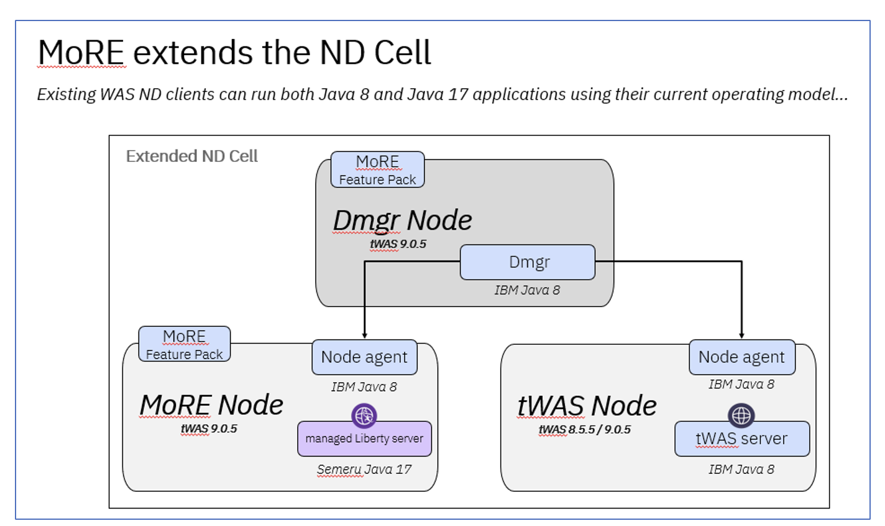
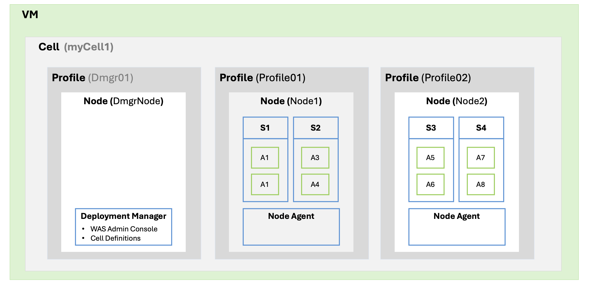
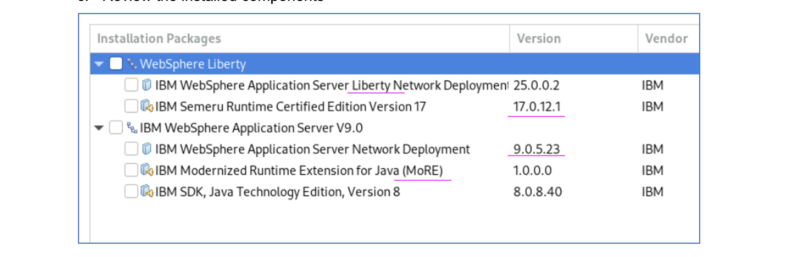
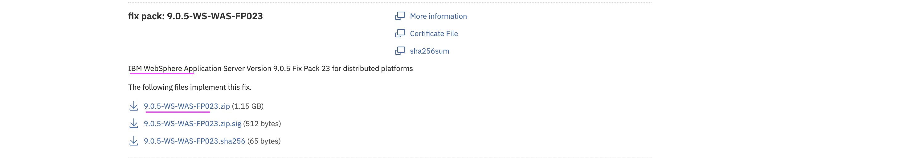
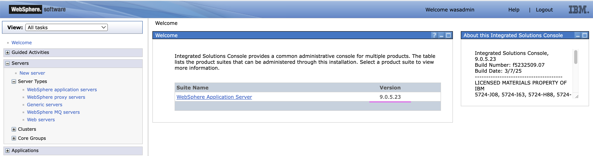
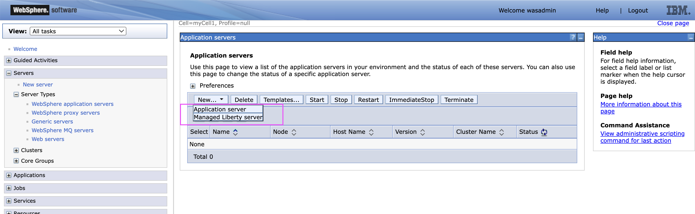

# Installing WAS ND and MoRE in Linux (Ubundu)

This document explains step by step instrutions to install WAS ND and MoRE in in Linux (Ubundu).

MoRE provides the capability to continue using traditional WebSphere Application Server (tWAS) Operational Model to manage Java 17 and Java 8 applications within the same traditional WebSphere administrative environment

MoRE helps the existing WAS ND Clients to run both Java 8 and Java 17 applications using the same operating model. The same WAS Admin Console can be leveraged to manage the environment.



In the above diagram
- `DMgr Node` is a Deployment Manager node which runs on Java 8.
- `tWAS Node` is a Server (tWAS) node which runs on Java 8.
- `MoRE Node` is a `Managed Liberty Server` which runs on Java 17.

## 1. Objective

The objective of this document is to explain the steps to deploy the following WAS ND along with MoRE. Here we are going to install only the Cell, Node and Profiles, not the Servers and applications.



It is required to have the below servers/software’s  installed and available. Lets install them in the upcoming steps.



## 2. Download Binaries

### 2.1. Create Install folder

Create a install folder like this.

```
mkdir -p /root/install1/
cd /root/install1/
```

### 2.2. Download Installation Manager

Download the Installation Manager binary from the fix Central <a href="https://www.ibm.com/support/fixcentral/swg/selectFixes?parent=ibm~Rational&product=ibm/Rational/IBM+Installation+Manager&function=all">URL</a>.

The download file could be `agent.installer.linux.gtk.x86_64_1.9.3002.20250425_1344.zip`

### 2.3. Download Packaging Utility 

Download the Packaging Utility binary from the fix Central <a href="https://www.ibm.com/support/fixcentral/swg/downloadFixes?parent=ibm%7ERational&product=ibm/Rational/IBM+Packaging+Utility&release=All&platform=All&function=fixId&fixids=1.9.3.2-IBMPU-LINUX-X86_64-20250425_1434&includeRequisites=1&includeSupersedes=0&downloadMethod=http">URL</a>.

The download file could be `pu.offering.disk.linux.gtk.x86_64_1.9.3002.20250425_1434.zip`

### 2.4. Download WAS ND 9.0.5.1

Download the WAS ND 9.0.5.1 binary `CC3P1ML :  IBM WebSphere Application Server Network Deployment V9.0.5.1 Multiplatform Multilingual` from Passport Advantage Online.

The download file could be `was.repo.90501.nd.zip`

### 2.5. Download WAS ND 9.0.5.23

Download the binary `IBM WebSphere Application Server Version 9.0.5 Fix Pack 23 for distributed platforms`
from the fix Central <a href="https://www.ibm.com/support/fixcentral/swg/downloadFixes?parent=ibm%2FWebSphere&product=ibm/WebSphere/WebSphere+Application+Server&release=All&platform=All&function=fixId&fixids=9.0.5-WS-WAS-FP023&includeRequisites=1&includeSupersedes=0&downloadMethod=http">URL</a>.




### 2.6 Download MoRE

Download the MoRE binary `IBM Modernized Runtime Extension for Java V1.0.0.0`
from the fix Central <a href="https://www.ibm.com/support/fixcentral/swg/selectFixes?parent=ibm%2FWebSphere&product=ibm/WebSphere/WebSphere+Application+Server&release=All&platform=All&function=fixId&fixids=1.0.0.0-WS-MORE">URL</a>.

### 2.7 Download JDK 8

Download the JDK 8 binary `CC1WVML  :  IBM SDK, Java (TM) Technology Edition, Version 8.0.5.35 for Linux Multilingual` from Passport Advantage Online for Customers.

### 2.8 Download JDK 17

Download the binary `IIBM Semeru Runtime Certified Edition, Version 17.0.15.0 for Linux 64-bit on Intel/AMD`
from the fix Central <a href="https://www.ibm.com/support/fixcentral/swg/selectFix?fixids=17.0.15.0-IBM-Semeru-Runtime-Certified-SDK-x64-linux-repo&product=ibm%2FWebSphere%2FWebSphere%20Liberty&source=dbluesearch&mhsrc=ibmsearch_a&mhq=%2017%26period%3B0%26period%3B15%26period%3B0-IBM-Semeru-Runtime-Certified-SDK-x64-linux-repo&function=fixId&parent=ibm/WebSphere">URL</a>.

### 2.9 Download WAS ND Liberty 25.0.0.1

Download the WAS ND Liberty binary `JAR Install: WebSphere Application Server Network Deployment Liberty 25.0.0.1 runtime environment and all features` from the fix Central <a href="https://www.ibm.com/support/fixcentral/swg/selectFixes?fixids=wlp-nd-all-25.0.0.1&product=ibm%2FWebSphere%2FWebSphere%20Liberty&source=dbluesearch&mhsrc=ibmsearch_a&mhq=wlp-nd-all-25%26period%3B0%26period%3B0&function=fixId&parent=ibm/WebSphere">URL</a>.

## 3. Extracts the downloads

Move the binaries into the appropriate folder and extract them.

```
cd /root/install1/

mkdir im
mkdir pu
mkdir java8
mkdir java17
mkdir more
mkdir wasnd
mkdir liberty
mkdir wasndfix

mv agent.installer.linux.gtk.x86_64_1.9.3002.20250425_1344.zip im
mv pu.offering.disk.linux.gtk.x86_64_1.9.3002.20250425_1434.zip pu
mv sdk.repo.8035.java8.linux.zip java8
mv ibm-semeru-certified-jdk_x64_linux_17.0.15.0-installmgr.zip java17
mv 1.0.0.0-WS-MORE.zip more
mv was.repo.90501.nd.zip wasnd
mv wlp-nd-all-25.0.0.1.jar liberty
mv 9.0.5-WS-WAS-FP023.zip wasndfix

cd im
unzip *.zip

cd ..
cd pu
unzip *.zip

cd ..
cd java8
unzip *.zip

cd ..
cd java17
unzip *.zip

cd ..
cd more
unzip *.zip

cd ..
cd wasnd
unzip *.zip

cd ..
cd wasndfix
unzip *.zip

```

## 4. Install the Binaries

**Note:** The installation steps given here are for easy reference. You can update the steps/commands as per your environment.

### 4.1 Install WAS ND 9.0.5.1

Install WAS ND, using the command below.

```
/opt/IBM/InstallationManager/eclipse/tools/imcl install \
  com.ibm.websphere.ND.v90 com.ibm.java.jdk.v8 \
  -repositories file:/root/install1/wasnd,file:/root/install1/java8 \
  -installationDirectory /opt/IBM/WebSphere/AppServer \
  -acceptLicense
```

You may see the output like this.

```
Installed com.ibm.websphere.ND.v90_9.0.5001.20190828_0616 to the /opt/IBM/WebSphere/AppServer directory.
Installed com.ibm.java.jdk.v8_8.0.5035.20190422_0948 to the /opt/IBM/WebSphere/AppServer directory.
```

### 4.2 Upgrade WAS ND 9.0.5.23

Upgrade the existing WAS ND with the fix pack, using the command below.

```
/opt/IBM/InstallationManager/eclipse/tools/imcl install \
  com.ibm.websphere.ND.v90_9.0.5023.20250307_1839 com.ibm.java.jdk.v8 \
  -repositories file:/root/install1/wasndfix,file:/root/install1/java8 \
  -installationDirectory /opt/IBM/WebSphere/AppServer \
  -acceptLicense
```

You may see the output like this.

```
Updated to com.ibm.websphere.ND.v90_9.0.5023.20250307_1839 in the /opt/IBM/WebSphere/AppServer directory.
Modified com.ibm.java.jdk.v8_8.0.5035.20190422_0948 in the /opt/IBM/WebSphere/AppServer directory.
```

### 4.3 Install MoRE

Install MoRE, using the command below.

```
/opt/IBM/InstallationManager/eclipse/tools/imcl install \
  com.ibm.websphere.MORE.v10_1.0.0.20250307_1858 \
  -repositories file:/root/install1/more \
  -installationDirectory /opt/IBM/WebSphere/AppServer \
  -acceptLicense
```

You may see the output like this.

```
Installed com.ibm.websphere.MORE.v10_1.0.0.20250307_1858 to the /opt/IBM/WebSphere/AppServer directory.
```


### 4.4 Verify the install

Run the below command to verify the install so far

```
/opt/IBM/InstallationManager/eclipse/tools/imcl listInstalledPackages
```

You may see the output like this.

```
/opt/IBM/InstallationManager/eclipse : com.ibm.cic.agent_1.9.3002.20250425_1344 : IBM® Installation Manager : 1.9.3.2
/opt/IBM/WebSphere/AppServer : com.ibm.java.jdk.v8_8.0.5035.20190422_0948 : IBM SDK, Java Technology Edition, Version 8 : 8.0.5.35
/opt/IBM/WebSphere/AppServer : com.ibm.websphere.MORE.v10_1.0.0.20250307_1858 : IBM Modernized Runtime Extension for Java (MoRE) : 1.0.0.0
/opt/IBM/WebSphere/AppServer : com.ibm.websphere.ND.v90_9.0.5023.20250307_1839 : IBM WebSphere Application Server Network Deployment  : 9.0.5.23
```
### 4.4 Install WAS ND Liberty 


1. Create `Liberty` folder using the below command

```
mkdir -p /opt/IBM/WebSphere/Liberty
```

2. Ensure you have java installed, if not install using the below command 

```
sudo apt install openjdk-17-jre-headless -y
```

3. Install `WAS ND Liberty` using the below command 

```
java -jar /root/install1/liberty/wlp-nd-all-25.0.0.1.jar --acceptLicense /opt/IBM/WebSphere/Liberty
```

## 5. Create Profile

### 5.1 Create the Deployment Manager (Dmgr01)

1. Run the below command to create a profile called `Dmgr01`.

```
/opt/IBM/WebSphere/AppServer/bin/manageprofiles.sh -create \
  -profileName Dmgr01 \
  -profilePath /opt/IBM/WebSphere/Profiles/Dmgr01 \
  -templatePath /opt/IBM/WebSphere/AppServer/profileTemplates/management \
  -cellName myCell1 \
  -nodeName DmgrNode \
  -hostName gan1.test.com \
  -adminUserName wasadmin \
  -adminPassword xxxxxxxx \
  -enableAdminSecurity true 
```

2. Run the below command to start the Manager.

```
/opt/IBM/WebSphere/Profiles/Dmgr01/bin/startManager.sh
```

### 5.2 Create Profile (Profile01)

1. Run the below command to create a profile called `Profile01`.

```
/opt/IBM/WebSphere/AppServer/bin/manageprofiles.sh -create \
  -profileName Profile01 \
  -profilePath /opt/IBM/WebSphere/Profiles/Profile01 \
  -templatePath /opt/IBM/WebSphere/AppServer/profileTemplates/default \
  -cellName myCell1 \
  -nodeName Node1 \
  -hostName node1.gan1.test.com \
```

2. Federate Node to Deployment Manager (DMgr)

```
/opt/IBM/WebSphere/Profiles/Profile01/bin/addNode.sh gan1.test.com 8879 -username wasadmin -password xxxxxxxx
```

3. Run the below command to start the Node.

Run the below command to create a start the Node/Profile called `Profile01`

```
/opt/IBM/WebSphere/Profiles/Profile01/bin/startNode.sh
```

### 5.3 Create Profile (Profile02)

1. Run the below command to create a profile called `Profile02`.

```
/opt/IBM/WebSphere/AppServer/bin/manageprofiles.sh -create \
  -profileName Profile02 \
  -profilePath /opt/IBM/WebSphere/Profiles/Profile02 \
  -templatePath /opt/IBM/WebSphere/AppServer/profileTemplates/default \
  -cellName myCell1 \
  -nodeName Node2 \
  -hostName node2.gan1.test.com \
```

2. Federate Node to Deployment Manager (DMgr)

```
/opt/IBM/WebSphere/Profiles/Profile02/bin/addNode.sh gan1.test.com 8879 -username wasadmin -password xxxxxxxx
```

3. Run the below command to start the Node.

Run the below command to create a start the Node/Profile called `Profile02`

```
/opt/IBM/WebSphere/Profiles/Profile02/bin/startNode.sh
```

## 6. Was Admin Console

1. Open the Admin Console https://localhost:9043/ibm/console

2. You can view the `WAS` with the 9.0.5.23 version



3. You should be able to see both `WAS` and `Managed Liberty Server` in the option.



## 7. Deploy App

1. Create a new profile.

2. Create a new `Managed Liberty Server` instance in the new profile.

3. Deploy Java 17+ application.

## 8. Conclusion

With the existing WAS ND, setup you can able to deploy the Java 17+ applications using the `Managed Liberty Server` and `MoRE feature pack` successfully.