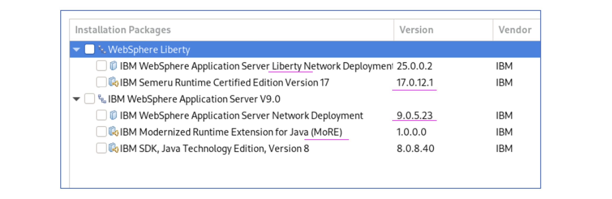

# Installing WAS ND, MoRE and Liberty in Linux (Ubundu)

The objective of this document is to install MoRE on top of WAS ND and run both tWAS Java 8 and Websphere Liberty Java 17+ applications in the same WAS ND.

This document provides step-by-step instructions for installing the following on a Linux machine running on Ubuntu 24.04.
- WebSphere Application Server Network Deployment (WAS ND) 9.0.5.23 
- MoRE (Modernized Runtime Extension) 1.0.0
- WebSphere Application Server Network Deployment Liberty (WAS ND Liberty) 25.0.0.3

At the end of the installation we will have the below servers/software’s installed and available.


## 1. About MoRE (Modernized Runtime Extension)

Refer <a href="../03-about-more">here </a> to undertand about Modernized Runtime Extension for Java (MoRE).

## 2. Objective

The objective of this document is to explain the steps involved in deploying the following WAS ND architecture along with MoRE. 


We are going to download the required binaries in the local folder and then we install them using Installation Manager CLI (imcl).

## 3. Download Binaries

### 3.1. Create Install folder

Create a install folder using this command.

```
mkdir -p /root/install1/
cd /root/install1/
```

### 3.2. Download Installation Manager

Download the Installation Manager binary from the fix Central <a href="https://www.ibm.com/support/fixcentral/swg/downloadFixes?parent=ibm%7ERational&product=ibm/Rational/IBM+Installation+Manager&release=All&platform=All&function=fixId&fixids=1.9.3.2-IBMIM-LINUX-X86_64-20250425_1344&includeRequisites=1&includeSupersedes=0&downloadMethod=http">URL</a>.

The download file could be `agent.installer.linux.gtk.x86_64_1.9.3002.20250425_1344.zip`

### 3.3. Download WAS ND 9.0.5.1

Clients can download the WAS ND 9.0.5.1 binary `CC3P1ML :  IBM WebSphere Application Server Network Deployment V9.0.5.1 Multiplatform Multilingual` from Passport Advantage Online.

IBMers can download it from <a href="https://w3.ibm.com/software/xl/download/ticket.wss ">here</a> using the above part number (CC3P1ML).

The download file could be `was.repo.90501.nd.zip`

### 3.4. Download WAS ND Fix 9.0.5.23

Download the fix binary `IBM WebSphere Application Server Version 9.0.5 Fix Pack 23 for distributed platforms`
from the fix Central <a href="https://www.ibm.com/support/fixcentral/swg/downloadFixes?parent=ibm%2FWebSphere&product=ibm/WebSphere/WebSphere+Application+Server&release=All&platform=All&function=fixId&fixids=9.0.5-WS-WAS-FP023&includeRequisites=1&includeSupersedes=0&downloadMethod=http">URL</a>.

This is a WebSphere traditional contains all (Base, Network Deployment, DMZ Secure Proxy Server). ND is also part of this..

The download file could be `9.0.5-WS-WAS-FP023.zip`


### 3.5 Download MoRE

Download the MoRE binary `IBM Modernized Runtime Extension for Java V1.0.0.0`
from the fix Central <a href="https://www.ibm.com/support/fixcentral/swg/downloadFixes?parent=ibm%2FWebSphere&product=ibm/WebSphere/WebSphere+Application+Server&release=All&platform=All&function=fixId&fixids=1.0.0.0-WS-MORE&includeRequisites=1&includeSupersedes=0&downloadMethod=http">URL</a>.

The download file could be `1.0.0.0-WS-MORE.zip`

### 3.6 Download JDK 8

Download the JDK 8 binary `IBM SDK, Java(TM) Technology Edition, Version 8.0.8.45 for Linux 64-bit on Intel/ AMD`  from the` <a href="https://www.ibm.com/support/fixcentral/swg/downloadFixes?parent=ibm%2FWebSphere&product=ibm/WebSphere/WebSphere+Liberty&release=All&platform=All&function=fixId&fixids=8.0.8.45-JavaSE-SDK-linux-x64-repo&includeRequisites=1&includeSupersedes=0&downloadMethod=http&source=fc">URL</a>.

The download file could be `8.0.8.45-JavaSE-SDK-linux-x64-installmgr.zip`


### 3.7 Download WAS ND Liberty 

Clients can download the WAS ND Liberty binary `CC3P2ML :  IBM WebSphere Application Server Liberty Network Deployment (IBM Installation Manager Install) V9.0.5.1 Multiplatform Multilingual	` from Passport Advantage Online.

IBMers can download from <a href="https://w3.ibm.com/software/xl/download/ticket.wss ">here</a> using the above part number (CC3P2ML).

The download file could be `was.repo.19009.liberty.nd.zip`


### 3.8 Download WAS ND Liberty Fix Pack 25.0.0.3

Download the WAS ND Liberty Fix Pack `WebSphere Application Server Network Deployment Liberty 25.0.0.3`
from the fix Central <a href="https://www.ibm.com/support/fixcentral/swg/downloadFixes?parent=ibm%2FWebSphere&product=ibm/WebSphere/WebSphere+Liberty&release=All&platform=All&function=fixId&fixids=25.0.0.3-WS-LIBERTY-ND-FP&includeRequisites=1&includeSupersedes=0&downloadMethod=http&source=fc">URL</a>.

The download file could be `25.0.0.3-WS-LIBERTY-ND-FP.zip`

### 3.9 Download JDK 17

Download the binary `IBM Semeru Runtime Certified Edition, Version 17.0.15.0 for Linux 64-bit on Intel/AMD`
from the fix Central <a href="https://www.ibm.com/support/fixcentral/swg/downloadFixes?parent=ibm%2FWebSphere&product=ibm/WebSphere/WebSphere+Liberty&release=All&platform=All&function=fixId&fixids=17.0.15.0-IBM-Semeru-Runtime-Certified-SDK-x64-linux-repo&includeRequisites=1&includeSupersedes=0&downloadMethod=http">URL</a>.

The download file could be `ibm-semeru-certified-jdk_x64_linux_17.0.15.0-installmgr.zip`

## 4. Extracts the downloads

Move the binaries into the appropriate folder and extract them.

```
cd /root/install1/

mkdir im
mkdir wasnd
mkdir wasndfix
mkdir more
mkdir java8
mkdir liberty
mkdir libertyfix
mkdir java17

mv agent.installer.linux.gtk.x86_64_1.9.3002.20250425_1344.zip im
mv was.repo.90501.nd.zip wasnd
mv 9.0.5-WS-WAS-FP023.zip wasndfix 
mv 1.0.0.0-WS-MORE.zip more
mv ibm-java-sdk-8.0-8.45-linux-x64-installmgr.zip java8
mv was.repo.19009.liberty.nd.zip liberty
mv 25.0.0.3-WS-LIBERTY-ND-FP.zip libertyfix
mv ibm-semeru-certified-jdk_x64_linux_17.0.15.0-installmgr.zip java17

c
cd im
unzip *.zip

cd ..
cd wasnd
unzip *.zip

cd ..
cd wasndfix
unzip *.zip

cd ..
cd more
unzip *.zip

cd ..
cd java8
unzip *.zip

cd ..
cd liberty
unzip *.zip

cd ..
cd libertyfix
unzip *.zip


cd ..
cd java17
unzip *.zip


```

## 5. Install the Binaries

**Note:** The installation steps given here are for easy reference. You can update the steps/commands as per your environment.

### 5.1 Install Installation Manager

```
cd /root/install1/im
./installc -acceptlicense
```

You may see the output like this.

```
Installed com.ibm.cic.agent_1.9.3002.20250425_1344 to the /opt/IBM/InstallationManager/eclipse directory.
```

### 5.2 Install WAS ND 9.0.5.1 with fix pack 9.0.5.23

Install WAS ND, using the command below.

```
/opt/IBM/InstallationManager/eclipse/tools/imcl install \
  com.ibm.websphere.ND.v90 com.ibm.java.jdk.v8 \
  -repositories file:/root/install1/wasnd,file:/root/install1/wasndfix,file:/root/install1/java8 \
  -installationDirectory /opt/IBM/WebSphere/AppServer \
  -acceptLicense
```

You may see the output like this.

```
Installed com.ibm.websphere.ND.v90_9.0.5023.20250307_1839 to the /opt/IBM/WebSphere/AppServer directory.
Installed com.ibm.java.jdk.v8_8.0.8045.20250423_0131 to the /opt/IBM/WebSphere/AppServer directory.
```

### 5.3 Install MoRE

Install MoRE, using the command below.

```
/opt/IBM/InstallationManager/eclipse/tools/imcl install \
  com.ibm.websphere.MORE.v10_1.0.0.20250307_1858 \
  -repositories file:/root/install1/more \
  -installationDirectory /opt/IBM/WebSphere/AppServer \
  -acceptLicense
```

You may see the output like this.

```
Installed com.ibm.websphere.MORE.v10_1.0.0.20250307_1858 to the /opt/IBM/WebSphere/AppServer directory.
```

### 5.4 Install WAS ND Liberty, Fix Package along with Java 17

Install WAS ND Liberty, Fix Package and Java 17, using the command below.

```
/opt/IBM/InstallationManager/eclipse/tools/imcl install \
  com.ibm.websphere.liberty.ND com.ibm.java.jdk.v17 \
  -repositories file:/root/install1/liberty,file:/root/install1/libertyfix,file:/root/install1/java17 \
  -installationDirectory /opt/IBM/WebSphere/Liberty \
  -acceptLicense
```

You may see the output like this.

```
Installed com.ibm.websphere.liberty.ND_25.0.3.20250310_1903 to the /opt/IBM/WebSphere/Liberty directory.
Installed com.ibm.java.jdk.v17_17.0.15000.20250506_0632 to the /opt/IBM/WebSphere/Liberty directory.
```


### 5.5 Verify the install

Run the below command to verify the install so far

```
/opt/IBM/InstallationManager/eclipse/tools/imcl listInstalledPackages
```

You may see the output like this.

```
com.ibm.cic.agent_1.9.3002.20250425_1344
com.ibm.java.jdk.v8_8.0.8045.20250423_0131
com.ibm.websphere.MORE.v10_1.0.0.20250307_1858
com.ibm.websphere.ND.v90_9.0.5023.20250307_1839
com.ibm.java.jdk.v17_17.0.15000.20250506_0632
com.ibm.websphere.liberty.ND_25.0.3.20250310_1903
```

## 6. Create Profile

### 6.1 Set Java Home

1. Run the below command to set JAVA_HOME.
```
export JAVA_HOME=/opt/IBM/WebSphere/AppServer/java/8.0
export PATH=$JAVA_HOME/bin:$PATH
```

### 6.2 Create the Deployment Manager (Dmgr01)

#### 6.2.1 Create Profile

1. Run the below command to create a profile called `Dmgr01`.

```
  /opt/IBM/WebSphere/AppServer/bin/manageprofiles.sh -create \
  -profileName Dmgr01 \
  -profilePath /opt/IBM/WebSphere/Profiles/Dmgr01 \
  -templatePath /opt/IBM/WebSphere/AppServer/profileTemplates/management \
  -cellName myCell1 \
  -nodeName DmgrNode1 \
  -hostName gan.test.com \
  -adminUserName wasadmin \
  -adminPassword xxxxxxxx \
  -enableAdminSecurity true 
```

You may see the output like this.

```
INSTCONFSUCCESS: Success: Profile Dmgr01 now exists. Please consult /opt/IBM/WebSphere/Profiles/Dmgr01/logs/AboutThisProfile.txt for more information about this profile.
```

#### 6.2.2 Start the Dmgr

1. Run the below command to Start the Dmgr`.

```
/opt/IBM/WebSphere/Profiles/Dmgr01/bin/startManager.sh
```

You may see the output like this.

```
ADMU0128I: Starting tool with the Dmgr01 profile
ADMU3100I: Reading configuration for server: dmgr
ADMU3200I: Server launched. Waiting for initialization status.
ADMU3000I: Server dmgr open for e-business; process id is 16977
```

### 6.3 Create Profile (Profile01)

#### 6.3.1 Create Profile

1. Run the below command to create a profile called `Profile01`.

```
/opt/IBM/WebSphere/AppServer/bin/manageprofiles.sh -create \
  -profileName Profile01 \
  -profilePath /opt/IBM/WebSphere/Profiles/Profile01 \
  -templatePath /opt/IBM/WebSphere/AppServer/profileTemplates/default \
  -nodeName Node1 \
  -hostName node1.gan.test.com \
  -serverName AppServer1
```

You may see the output like this.

```
INSTCONFSUCCESS: Success: Profile Profile01 now exists. Please consult /opt/IBM/WebSphere/Profiles/Profile01/logs/AboutThisProfile.txt for more information about this profile.
```

#### 6.3.2 Federate Node

1. Federate Node to Deployment Manager (DMgr)

```
/opt/IBM/WebSphere/Profiles/Profile01/bin/addNode.sh gan.test.com 8879 -username wasadmin -password xxxxxxxx
```

You may see the output like this.

```
ADMU0116I: Tool information is being logged in file /opt/IBM/WebSphere/Profiles/Profile01/logs/addNode.log
ADMU0128I: Starting tool with the Profile01 profile
.
.
ADMU0003I: Node Node1 has been successfully federated.
```

### 6.4 Create Profile (Profile02)

#### 6.4.1 Create Profile

1. Run the below command to create a profile called `Profile02`.

```
/opt/IBM/WebSphere/AppServer/bin/manageprofiles.sh -create \
  -profileName Profile02 \
  -profilePath /opt/IBM/WebSphere/Profiles/Profile02 \
  -templatePath /opt/IBM/WebSphere/AppServer/profileTemplates/default \
  -nodeName Node2 \
  -hostName node2.gan.test.com \
  -serverName AppServer2
```

You may see the output like this.

```
INSTCONFSUCCESS: Success: Profile Profile02 now exists. Please consult /opt/IBM/WebSphere/Profiles/Profile02/logs/AboutThisProfile.txt for more information about this profile.
```

#### 6.4.2 Federate Node

1. Federate Node to Deployment Manager (DMgr)

```
/opt/IBM/WebSphere/Profiles/Profile02/bin/addNode.sh gan.test.com 8879  -username wasadmin -password xxxxxxxx
```

You may see the output like this.

```
ADMU0116I: Tool information is being logged in file /opt/IBM/WebSphere/Profiles/Profile02/logs/addNode.log
ADMU0128I: Starting tool with the Profile02 profile
.
.
ADMU0003I: Node Node2 has been successfully federated.
```

## 7. WAS Admin Console

1. Open the Admin Console https://gan.test.com:9043/ibm/console

2. You can view the `WebSphere Application Server` with the `9.0.5.23` version


3. You should be able to see both `Application Server` and `Managed Liberty Server` in the option.


4. The Cell Topology looks like this.


## 8. Deploy App

1. Create a new profile.

2. Create a new `Managed Liberty Server` instance in the new profile.

3. Deploy Java 17+ application.

### Deploy Java 17 application in Managed Liberty Server

Deploy the Websphere Liberty Java 17 application using the below steps.


Open the application using the url http://xxxxxx:9082/resorts/


### Deploy Java 8 application in WAS 

Deploy the tWAS Java 8 application using the below steps.


Open the application using the url http://xxxxxx:9080/resorts/


## 9. Conclusion

In the WAS ND, you can able to deploy the Java 17+ applications using the `Managed Liberty Server` and `MoRE feature pack` successfully.