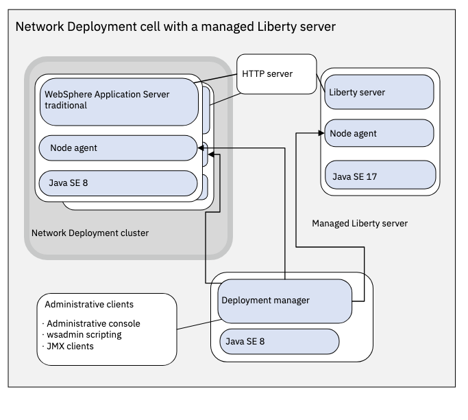
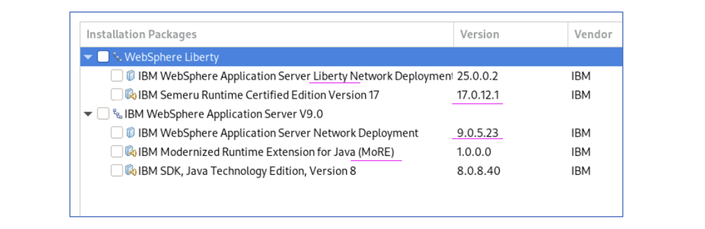
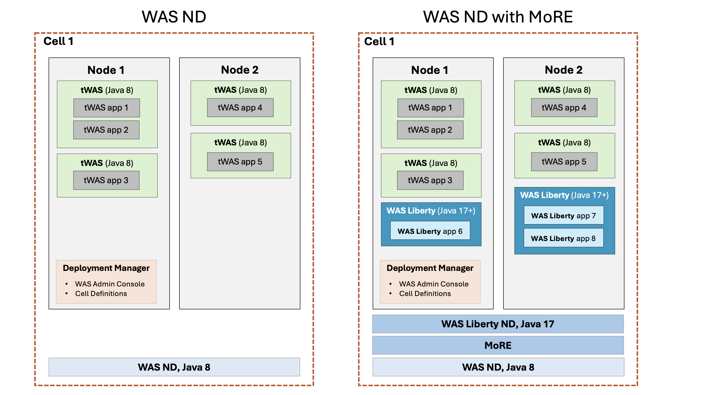
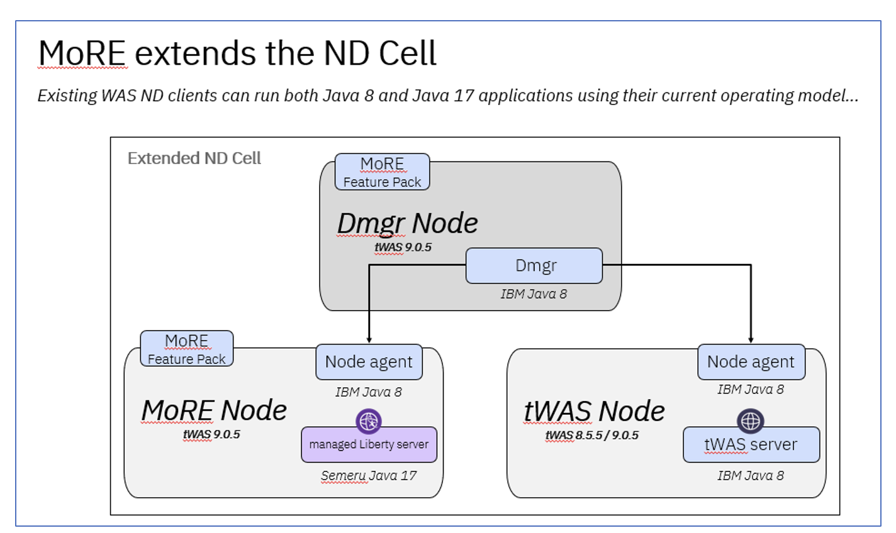

# Modernized Runtime Extension for Java (MoRE)

The objective of this document is to explain about MoRE.

## 1. Introduction

MoRE provides the capability to continue using `traditional WebSphere Application Server (tWAS)` Operational Model to manage `Java 17` and `Java 8` applications within the same traditional WebSphere administrative environment

`MoRE` helps the existing `WAS ND` Clients to run both existing `Java 8` and new `Java 17` applications using the same operating model. The same `WAS Admin Console` can be leveraged to manage the environment.

## 2. Software’s Required

It is required to have the below servers/software’s installed for MoRE. 

## 3. WAS ND Definitions

#### Cells -> Nodes -> tWAS servers-> tWAS applications
- `WAS ND` can have n number of `Cells`.
- `Cell` can have n number of `nodes/profiles`. 
- `Node` can have n number of tWAS servers 
- `tWAS server` can have n number of Java8 `tWAS` applications.
#### Clusters
- Clusters also can be created by connecting few tWAS servers in the cell.
#### WAS Admin Console
- All these cells, nodes, tWAS servers, applications and clusters are managed through WAS Admin Console.

## 4. Use Case

#### Current  Situation
- An enterprise already have 2000 tWAS applications with java8 running across several cells, nodes, servers and clusters and managed via WAS Admin console.
#### Changes Required
- Now that enterprise wants to develop 20 new applications and migrate existing 30 applications with Java 17+ versions and deploy it in the existing setup in WAS ND to continue to operate  in existing managed clusters/version to minimize disruption and reduce the need for new infrastructure 
#### Challenges
- It is not feasible to deploy Java17+ applications in existing  WAS ND as it supports tWAS up to java 8 only.
#### MoRE
- By installing MoRE along with WAS ND Liberty in the existing WAS ND environment, it allows to run WAS Liberty with Java 17+ applications along with the existing tWAS applications with java8. 
#### After installing MoRE
- The enterprise can deploy the new 20 applications (WAS Liberty Java 17+) and 30 migrated applications (WAS Liberty Java 17+) along with the remaining 1970 applications (tWAS java8 ) in the same WAS ND environment.
#### Conclusion
- With MoRE the WAS ND supports both tWAS Java8 apps and WAS Liberty Java 17+ apps.
- You can create new WAS Liberty Java 17+ application and deploy
- You can migrate few of the existing tWAS Java8 applications into WAS Liberty Java 17+ application and deploy. 
- You can keep non-migrated tWAS Java8 applications running as it is.

## 5. MoRE architecture.

The diagram illustrate the following.

#### WAS ND
- WAS ND is installed along with Java 8
- 4 tWAS servers are installed across 2 nodes
- 5 tWAS apps with java 8 are running across that 4 tWAS servers.

#### WAS ND with MoRE
On top of the existing setup the following are installed.
- MoRE is installed
- WAS Liberty ND is installed along with Java 17
- 2 WAS Liberty servers are installed across 2 nodes
- 3 WebSphere Liberty apps with java 17 are deployed across that 2  WAS Liberty servers.

## 6. Another view of MoRE architecture.

In the above diagram
- `DMgr Node` is a Deployment Manager node which runs on Java 8.
- `tWAS Node` is a node that contains tWAS server which runs on Java 8.
- `MoRE Node` is a node that contains `Managed Liberty Server`server which runs on Java 17.

## 7. Reference

Modernized Runtime Extension for Java overview : https://www.ibm.com/docs/en/more?topic=overview